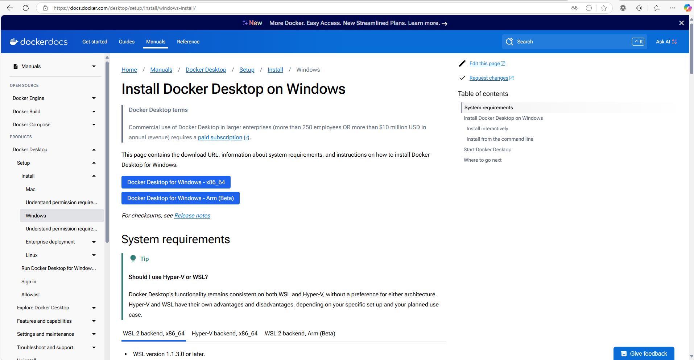
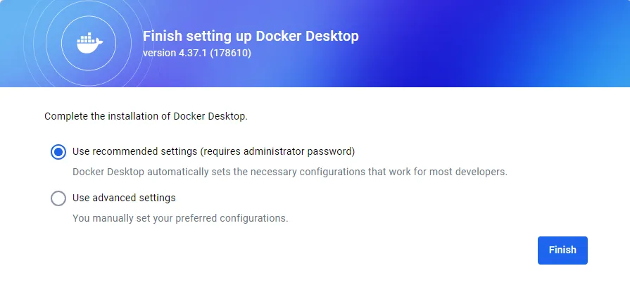

# Ejercicio 1 - Manual de Docker Desktop

> Realizado por Abdallah Bouallag y Alejandro Luis
> 

- Accedemos a la pagina del Docker desktop y descargamos el fichero para nuestro sistema operativo

- Al acabar la descarga, lo ejecutamos y comienza la instalacion

- Se comenzaran a descomprimir los archivos de docker desktop, esto puede tardar unos minutos

- Después de ese tiempo habrá acabado la instalacion y podremos abrir ya docker desktop en nuestro equipo

- En nuestro caso hemos elegido los ajustes recomendados

## GitHub Projects

- Así quedaría el GitHub Project por el momento

