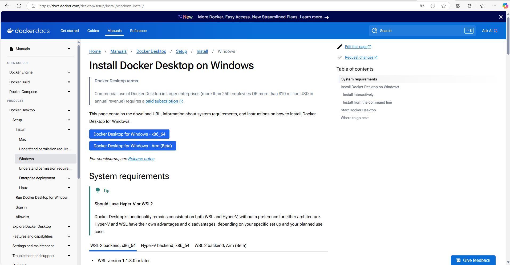
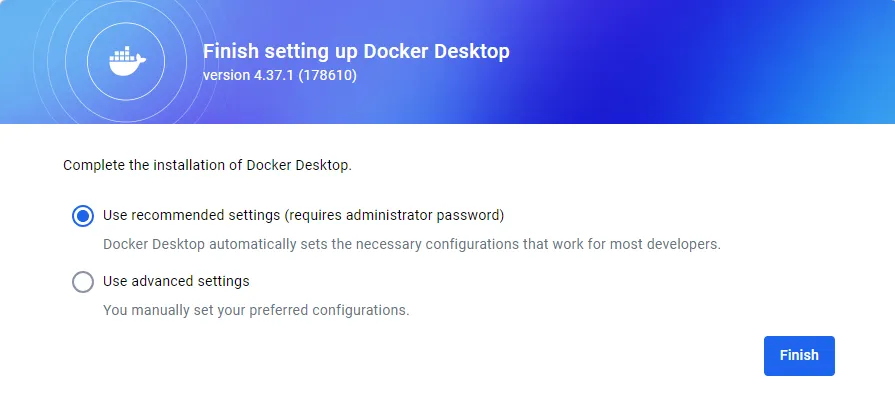

# Ejercicio 1 - Manual de Docker Desktop

> Realizado por Abdallah Bouallag y Alejandro Luis
> 

## Proceso de Instalación

- Accedemos a la pagina del Docker desktop y descargamos el fichero para nuestro sistema operativo



- Al acabar la descarga, lo ejecutamos y comienza la instalacion


- Se comenzaran a descomprimir los archivos de docker desktop, esto puede tardar unos minutos


- Después de ese tiempo habrá acabado la instalacion y podremos abrir ya docker desktop en nuestro equipo


- En nuestro caso hemos elegido los ajustes recomendados



## ¿Qué es Docker Desktop?

- Docker Desktop es una aplicación que facilita la creación, administración y ejecución de contenedores en sistemas Windows, macOS y Linux. Proporciona una interfaz gráfica amigable y herramientas esenciales para desarrolladores.


## Containers (Contenedores)

Este apartado muestra la lista de contenedores en ejecución y detenidos. Desde aquí puedes:

- Iniciar, detener y eliminar contenedores.
- Acceder a la consola de logs de cada contenedor.
- Modificar configuraciones y establecer variables de entorno.
- Ver detalles como puertos expuestos y montajes de volúmenes.


## Images (Imagenes)

En esta sección puedes gestionar todas las imágenes Docker almacenadas en tu sistema. Permite:

- Descargar nuevas imágenes desde Docker Hub con `docker pull`.
- Crear imágenes propias mediante `docker build`.
- Eliminar imágenes innecesarias para liberar espacio.


## Volumes (Volúmenes)

Los volúmenes permiten almacenar datos de manera persistente, incluso cuando los contenedores se eliminan. Desde esta sección puedes:

- Crear, listar y eliminar volúmenes.
- Ver qué contenedores están usando cada volumen.
- Inspeccionar el contenido de un volumen para verificar su uso.


## Builds (Compilaciones)

Este apartado facilita la gestión de compilaciones y despliegues de imágenes Docker, especialmente cuando se trabaja con sistemas de integración continua (CI/CD). Puedes:

- Monitorear el estado de las compilaciones recientes.
- Revisar errores y logs de construcción.
- Administrar las configuraciones de compilación de imágenes.


## Docker Scout

Docker Scout permite analizar las imágenes en busca de vulnerabilidades de seguridad. Desde aquí puedes:

- Escanear imágenes en busca de fallos de seguridad.
- Obtener recomendaciones para mejorar la seguridad de tus contenedores.
- Mantener un historial de escaneos y mejoras aplicadas.


## Extensions (Extensiones)

Las extensiones permiten agregar funcionalidades adicionales a Docker Desktop. Puedes:

- Instalar herramientas complementarias para mejorar tu flujo de trabajo.
- Integrar plugins de terceros para monitoreo, seguridad y despliegue.
- Personalizar la experiencia según tus necesidades.


# Otros elementos de la interfaz

## Zona central

- Muestra la lista de contenedores en ejecución (actualmente vacía en la imagen).
- Presenta accesos rápidos a tutoriales, como *¿Qué es un contenedor?* y *¿Cómo ejecutar un contenedor?*


## Barra superior

- **Búsqueda:** Puedes buscar imágenes o contenedores.
- **Opciones de configuración:** Permite cambiar ajustes como recursos asignados a Docker.
- **Notificaciones y ayuda:** Accesos a soporte y actualizaciones.


## Terminal en la parte inferior

- Permite ejecutar comandos de Docker directamente sin necesidad de abrir una terminal externa.
- En la imagen se observa un *PowerShell* en Windows.


# Comandos Básicos Docker Desktop

### Ejecutar un Contenedor

Para ejecutar un contenedor de prueba con Nginx:

```bash
docker run -d -p 8080:80 nginx
```

### Listar Contenedores

```bash
docker ps
```

### Detener un Contenedor

```bash
docker stop <ID_DEL_CONTENEDOR>
```

### Eliminar un Contenedor

```bash
docker rm <ID_DEL_CONTENEDOR>
```

## Administración de Imágenes

### Descargar una Imagen

```bash
docker pull ubuntu
```

### Listar Imágenes Disponibles

```bash
docker images
```

### Eliminar una Imagen

```bash
docker rmi ubuntu
```

## Uso de Volúmenes

### Crear un Volumen

```bash
docker volume create mi_volumen
```

### Ver Volúmenes Existentes

```bash
docker volume ls
```

### Eliminar un Volumen

```bash
docker volume rm mi_volumen
```