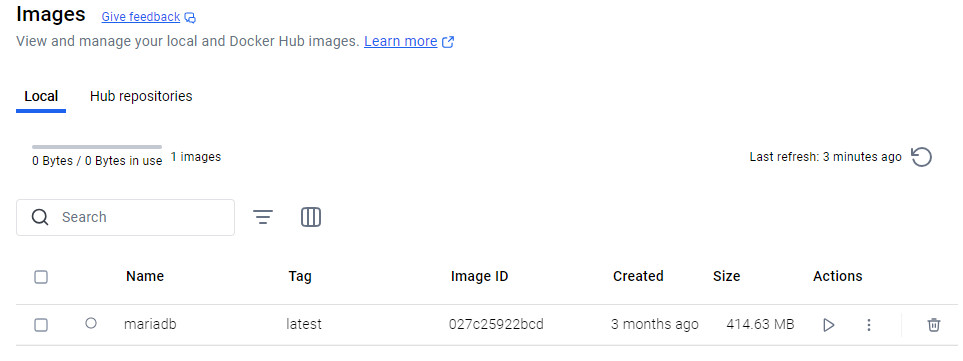

# Ejercicio 2 - Servidor de Base de Datos

> Realizado por Abdallah Bouallag y Alejandro Luis
> 

- Abrimos **Docker Desktop**.
- Vamos a la sección **"Imagenes"**.
- Buscamos `mariadb`.
- Si no tenemos la imagen , la descargamos ejecutando en la terminal:

- Así se vería después de acabar la descarga de la imagen.

- Creamos y ejecutamos un contenedor con MariaDB con estos datos

- Iniciamos el contenedor, se debería ver algo así

- Después de introducir los datos en DBeaver, probé la conexión y como funciono, acepte y se creo la conexión.

- Ahora cree una base de datos llamada prueba con un campo llamado nombre

- Primero buscamos el contenedor, lo detenemos y luego lo borramos

- Después de borrar el contenedor revisamos el apartado volúmenes y si lo hemos hecho de la forma correcta debería verse algo así

- Creamos otro contenedor con el mismo volumen con estos datos y lo arrancamos

- Intentamos borrar la imagen de mariadb y como era de esperar al estar usándose nos da este mensaje

- Como ultimo paso borramos todo

## GitHub Projects

- Así quedaría el GitHub Project por el momento.

