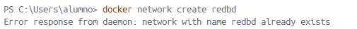

# Ejercicio 3 - Contenedores en Red: Adminer y MariaDB

> Realizado por Abdallah Bouallag y Alejandro Luis
> 
- Creamos una red bridge `redbd`

```bash
docker network create redbd
```



> En nuestro caso nos da error por que ya la habíamos creado
> 

- Verificamos que fue creada correctamente

```bash
docker network ls
```


- Creamos un contenedor de MariaDB en la red `redbd`

```bash
docker run -d --name mariadb-server `
--network redbd `
-e MYSQL_ROOT_PASSWORD=admin123 `
-v mariadb_data:/var/lib/mysql `
-p 3306:3306 `
mariadb
```


- Verificamos que el contenedor se haya creado de forma correcta con el siguiente comando

```bash
docker ps
```


- Crea un contenedor de Adminer o phpMyAdmin
- Nosotros elegimos **phpMyAdmin**

```bash
docker run -d `
  --name phpmyadmin `
  --network redbd `
  -e PMA_HOST=mariadb-server `
  -p 8080:80 `
  phpmyadmin/phpmyadmin
```


> Como no teníamos descargada la imagen de phpMyAdmin antes de crear el container procedió a la descarga de la imagen.
> 

- Accedemos a [**http://localhost:8080](http://localhost:8080)** y ya veremos la pagina de phpMyAdmin.


> Usuario: root - Contraseña: admin123
> 

- Después de acceder a phpMyAdmin nos piden crear una base de datos y una tabla en el servidor de la base de datos.


> Nosotros le llamamos empresa_db
> 
- Nos pedirá crear la primera tabla de la base de datos


- Al darle a crear nos pedirá rellenar los 3 campos que seleccionamos que tendría nuestra tabla, la nuestra quedo algo así


- También la podríamos crear con SQL con el siguiente código.

```bash
CREATE TABLE empleados (
    id INT AUTO_INCREMENT PRIMARY KEY,
    nombre VARCHAR(100) NOT NULL,
    puesto VARCHAR(50) NOT NULL
);
```

- Y así quedaría después de crearla


- Para finalizar la tarea nos piden borrar los contenedores y los volúmenes, nosotros lo haremos desde la interfaz grafica que nos parece lo mas fácil.

> Antes
> 


> Después
> 


```bash
docker network rm redbd
docker network ls
```


## GitHub Projects

- Así quedaría el GitHub Projects por el momento


