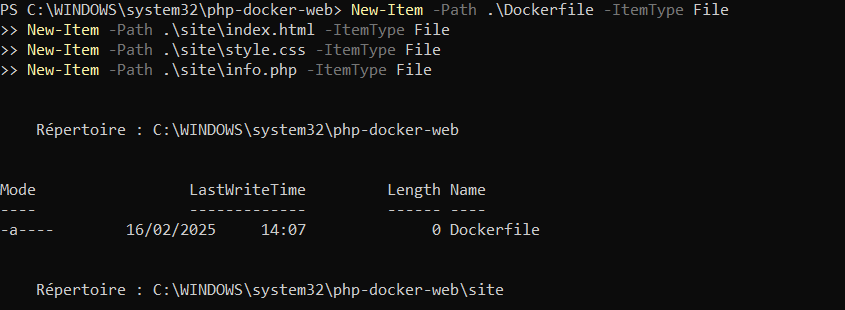

# Ejercicio 5 - Imagen con Dockerfile - Aplicación web

> Realizado por Abdallah Bouallag y Alejandro Luis
> 

## Creación inicial del contenedor

- Primero de todo , creo la carpeta y los archivos



- Creo  el bloque de código con el Dockerfile


- Luego creo en el directorio raíz la pagina de Index.html , CSS y la PHP


```html
<!DOCTYPE html>
<html lang="es">
<head>
    <meta charset="UTF-8">
    <meta name="viewport" content="width=device-width, initial-scale=1.0">
    <title>Grupo Web</title>
    <link rel="stylesheet" href="style.css">
</head>
<body>
    <h1>Bienvenidos al Sitio Web del Grupo</h1>
    <p>Consulta la información del servidor <a href="info.php">aquí</a>.</p>
</body>
</html>
```


```css
body {
    font-family: Arial, sans-serif;
    text-align: center;
    margin-top: 50px;
}
```


```php
<?php
    setlocale(LC_TIME, "es_ES.UTF-8");
    $mes_actual = strftime("%B");
    $fecha_actual = date("d/m/Y");
    $hora_actual = date("H:i:s");
    
    echo "<h1>Información</h1>";
    echo "<p>Hoy es $fecha_actual</p>";
    echo "<p>El mes es: <strong>$mes_actual</strong></p>";
    echo "<p>Hora: $hora_actual</p>";
?>
```

## **Creación de nueva imagen**

- Creo la imagen con el Docker Build y luego la arranco

```bash
docker buid -t php-web-app .
```


```bash
docker run -d --name web -p 8000:80 php-web-app
```


- Para acceder a la pagina de Bienvenida

```bash
localhost:8080
```


- Para acceder a la pagina de Información

```bash
localhost:8000/info.php
```


## Subida del imagen a la cuenta Docker

- Subo la imagen a mi cuenta Docker con el Tag

```powershell
docker tag php-web-app abdallahb7/php-web-app:v1
```


- Hago un Push al Repositorio

```powershell
docker push abdallahb7/php-web-app:v1
```


## Descargar y ejecutar la imagen en otro equipo

- Descargo la imagen y comienza la descarga

```powershell
docker pull abdallahb7/php-web-app:v1
```


- Al acabar la descarga compruebo que se ha descargado de forma correcta

```powershell
docker images
```


- Ejecuto un contenedor con la imagen descargada y lo abro en el puerto 8000

```powershell
docker run -d --name web -p 8000:80 abdallahb7/php-web-app:v1
```


- Comprobamos que es correcto

```powershell
docker ps
```


- Accedemos al [localhost](http://localhost) 8000 y ya veremos la pagina de Bienvenida

```powershell
localhost:8000
```


- Y aquí la pagina de información

```powershell
localhost:8000/info.php

```


## GitHub Projects

- Así quedaría el GitHub Project por el momento.


